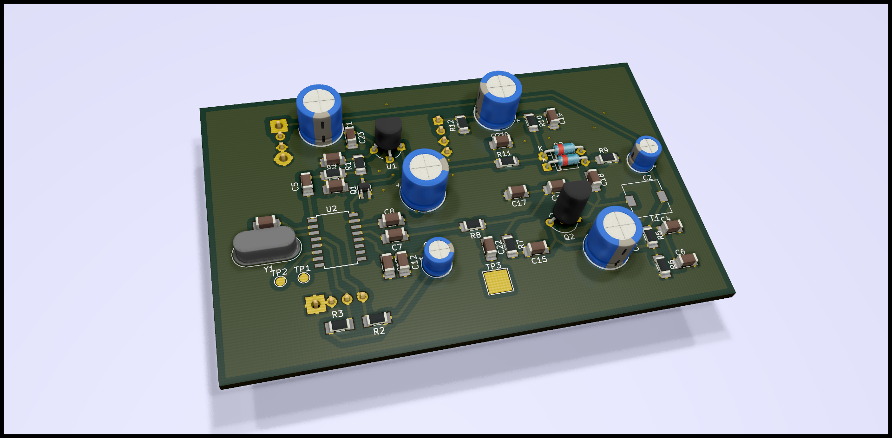

# tsa5512-pll-board
PCB for VCO combined with the TV/VCR Tuner controller TSA5512T

VCO is implemented with a simple varactor controlled Colpitts oscillator. 
Capacitor/Inductor values should be adjusted according to the desired operating frequency range. Current component values are chosen to oscillate in FM band.
TSA5512 is a cheap Philips PLL IC mainly made for TV tuner applications. DIY-famous UV916 tuner also contains this chip (like many other tuners).
PLL is configured over I2C, which can easily be achieved with an Arduino board. Programming details can be found in the datasheet (http://pira.cz/pdf/TSA5512.pdf)

Some components are through-hole, because I've had a bunch of them at hand. SMD resistor/capacitors are spread all over the board and they can easily be found on any scrap electronic equipment with a sufficient size.
For higher frequency requirements (UHF band, ~300MHz) original tuner designs can be taken as a reference. BFR92 transistor will be more appropriate for the oscillator and special care should be taken in order to encapsulate the signal nets (t. lines and keepout regions mainly).

3D board view of the top-side:

